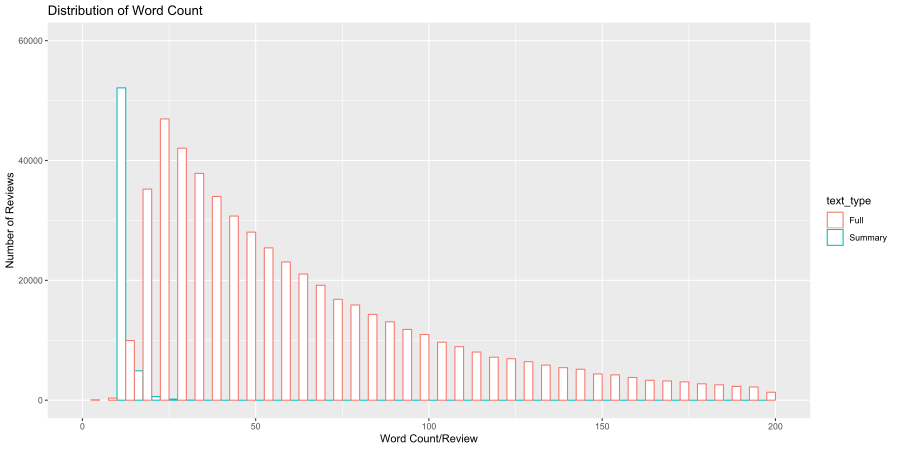
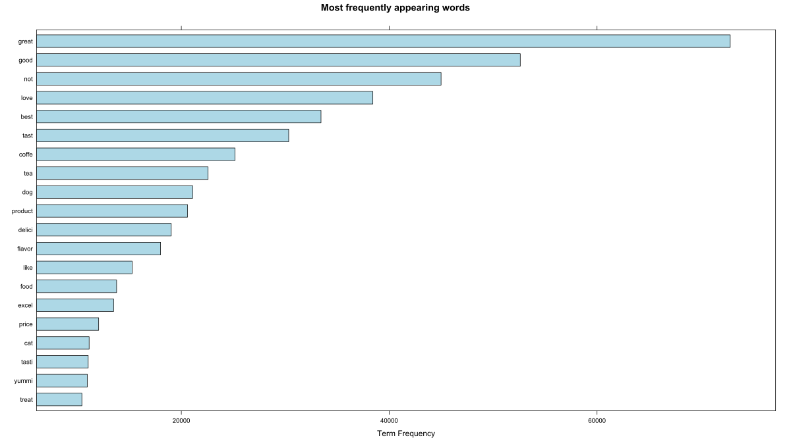
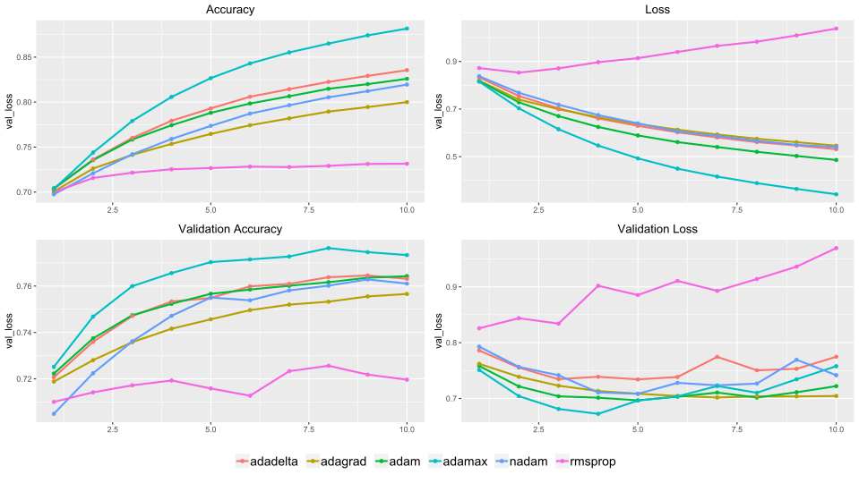
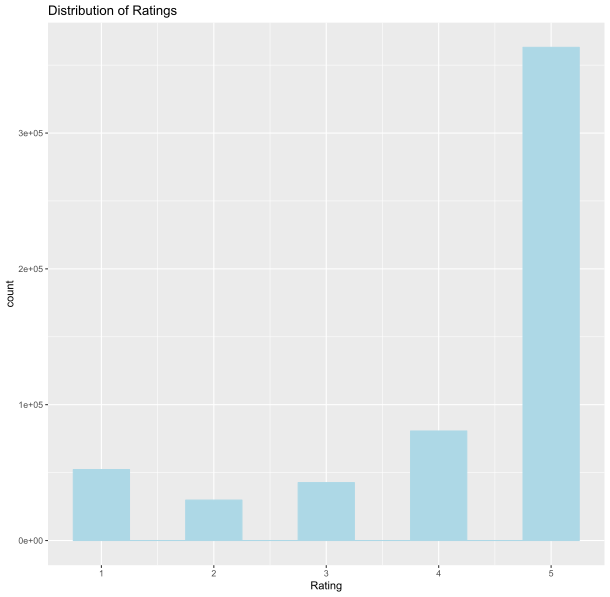
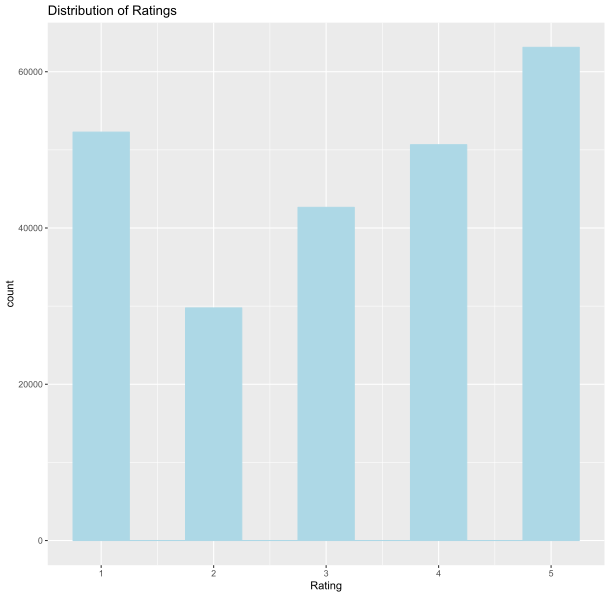
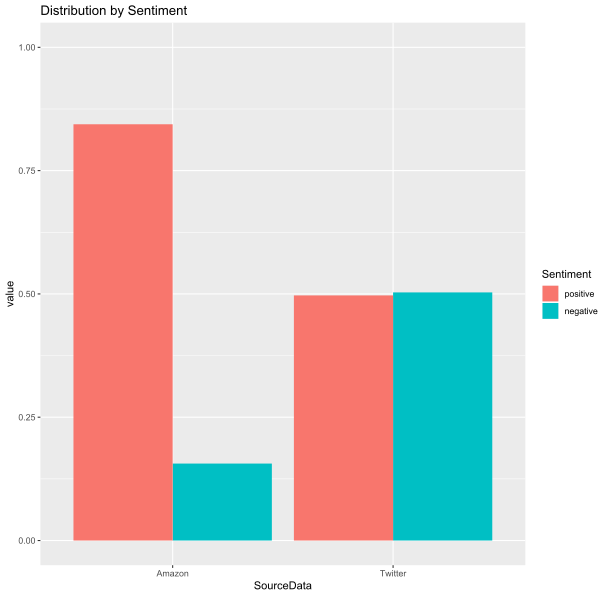

```{r setup, include=FALSE}
options(htmltools.dir.version = FALSE)
# find.image searches subdirectories for partial match of argument. Useful when some images are dynamically generated
find.image=function(name){grep(name,list.files(recursive = TRUE),value=TRUE)}

# Example of how to use find.image to display an image
#`)

```


#Can we predict rating from reviews?

```{r, echo = F}
library(kableExtra)


text_tbl <- data.frame( c("Product Id","Profile Name", "Helpfulness of Review","Time of Review", "Product Rating",
                          "Summary","Full Review"),
                        c("B001E4KFG0","delmartian","1","1303862400","5","Good Quality Dog Food",
                          "I have bought several of the Vitality canned dog food products and have found them all to be of good quality. The product looks more like a stew than a processed meat and it smells better. My Labrador is finicky and she appreciates this product better than  most.
")) 

kable(text_tbl,align=c( rep('c',times=1),"c" ) ,
      escape = FALSE,
      col.names = c("Column", "Example" ) )  %>%
  kable_styling(full_width = F, font_size = 18) %>%
  column_spec(1,width = "50 em", bold = T ) %>%
  column_spec(2, width = "10 em", bold = F   )  %>%
  row_spec(c(2,4),  background = "#e7ebea")%>%
  row_spec(c(1,3 ),  background = "#cbd7d5") %>%
  row_spec(c(5:7),  background = "thistle") %>%
  row_spec(0, align = "c", background = "#d0af95" )
```

.center[.large[Rows in lavender are the focus of our study.]]

---

#Data Overview


```{r, echo = F}
library(kableExtra)
hamazon <- read.csv("G:\\math\\514\\template\\hamazon.csv",header = T)
hamazon[,ncol(hamazon)] <- as.character(hamazon[,ncol(hamazon)])
text_tbl <- hamazon 
colnames(hamazon) <- c("Rating", "Example Summary", "Example Full Review")

kable(text_tbl,align=c( rep('c',times=2),"l" ) ,
      escape = FALSE,
      col.names = c("Rating", "Example: \nSummary", "Example: Full Review") )  %>%
  kable_styling(full_width = F, font_size = 18) %>%
  column_spec(1,width = "10 em", bold = T ) %>%
  column_spec(2, width = "10em", bold = F   )  %>%
  column_spec(3, width = "45em" , bold = F   )   %>%
  row_spec(c(2,4),  background = "#e7ebea")%>%
  row_spec(c(1,3,5),  background = "#cbd7d5") %>%
  row_spec(0, align = "c", background = "#d0af95" )
```

---
#Data Overview

```{r, echo = F}
library(kableExtra)

text_tbl <- data.frame( c("Summary","Full"), c(4,56),c(42,3432)) 

kable(text_tbl,align=c( rep('c',times=3) ) ,
      escape = FALSE,
      col.names = c("Text Type", "Median Word Count / Review", "Max Word Count / Review") )    %>%
  kable_styling(full_width = F, font_size = 18) %>%
  column_spec(1,width = "5em", bold = T ) %>%
  column_spec(2, width = "8em", bold = T   )  %>%
  column_spec(3, width = "7em" , bold = T   )   %>%
  row_spec(1,  background =  "#f8f0e8")%>%
  row_spec(2,  background = "#e9dfd1") %>%
  row_spec(0,  background = "#c2a25a")
 
```


 

---
#Data Overview

 


---
#Main questions explored:
 
 ###I. Comparison of different modelling techniques 

1. How do different types of embedding impact performance?

--

1. How do different regularization techniques impact performance?

--

1. How do different types of optimizers impact performance?

--


 ###II. Does the model built on Full Review perform better than the model built on summary text?
 
--


 ###III. Does the best-performing model for Amazon reviews generalize well for predicting positive or negative sentiment in Tweets?  
 
---

# Cleaning the text data

**Raw Data**

"Good Quality Dog Food $\hspace{2em}$ "Not as Advertised" $\hspace{2em}$ " 'Delight' says it all"

--

-	Remove Punctuation
-	Convert to lower case
-	Remove Numbers
-	Remove “stop words” (i.e. as, the, etc.)
-	Apply stemdocument (i.e. convert each word to its root)

-- 

"good quality dog food $\hspace{2em}$ "Not Advertis" $\hspace{2em}$ "delight says"

---
# Converting the text data

**Text tokenization utility**

- Vectorize a text corpus, by turning each text into either a sequence of integers (each integer being the index of a token in a dictionary) or into a vector where the coefficient for each token could be binary, based on word count, based on tf-idf...


```{r}
library(keras)
text_tokenizer
```

---
#Converting the text data
`texts_to_matrix`

- Convert a list of texts to a matrix. Gives us a $525814 \times 3000$ matrix.

  
```{r, eval=F}
# max_features = max amount of words (3000)
tokenizer <- text_tokenizer( num_words = max_features   ) %>% 
	fit_text_tokenizer( TEXT )

texts_to_matrix(tokenizer,cattext, mode = "tfidf")
```

.center[**TF: Term Frequency, which measures how frequently a term occurs in a document. **]

.center[$TF(t) = \cfrac{ \ \text{Number of times term } t \text{ appears in a document} \ }{\text{Total number of terms in the document}}$]

.center[**IDF: Inverse Document Frequency, which measures how important a term is.**]


.center[$IDF(t) = \log\left(\cfrac{\text{Total number of documents }}{ \ \text{Number of documents with term } t \text{ in it} \ }\right)$]


---
#Converting the text data


**TF-IDF Example:**

Consider a document containing 100 words wherein the word cat appears 3 times. 

The term frequency (i.e., tf) for cat is then (3 / 100) = 0.03.

Now, assume we have 10 million documents and the word cat appears in one thousand of these. Then, the inverse document frequency (i.e., idf) is calculated as log(10,000,000 / 1,000) = 4. 

Thus, the Tf-idf weight is the product of these quantities: 0.03 * 4 = 0.12.
---


# Model Selection: A Hierarchy of Choices

There are dozens of choices at each level that effect model quality

--

- Text processing / NLP choices: embedding, tokenization, word counts, padding length…

--

- Hyperparameter options: learning rates & schedules, optimizer, batch size, nodes, layers, etc…

--

Overall thought for this dataset: Keep as much information as possible.

--

- The dataset isn’t that large (~300mb).

--

- Run into some memory challenges on personal computer, but Google Cloud and AWS easily deal with these issues.

--

- Don’t need to perform that much dimensionality reduction if machines can handle it.


---

# Optimizers

- Adagrad
  + Optimizer with parameter-specific learning rates, which are adapted relative to how frequently a parameter gets updated during training. The more updates a parameter receives, the smaller the learning rate.
- RMSprop
  + Divide the gradient by a running average of its recent magnitude
- Adam
  + Uses the squared gradients to scale the learning rate like RMSprop and it takes advantage of momentum by using moving average of the gradient instead of gradient itself like SGD with momentum
- Adadelta
  + A more robust extension of Adagrad that adapts learning rates based on a moving window of gradient updates, instead of accumulating all past gradients
- Nadam
  + Nadam is Adam RMSprop with Nesterov momentum
- Adamax
  + Variant of Adam based on the infinity norm


---

# Which Optimizer to choose?

Compare performance: in sample accuracy / loss & out of sample accuracy / loss

- Four layer, feed forward network with 400 nodes per layer.
- Dropout rate of 0.2 at each layer.
- 10 Epochs; Batch size is 32; All the optimizers have their default arguments.

.center[**Adamax had the best performance in 3 out of the 4 criteria.**]

---
 # Which Optimizer to choose?



---

# Hyperparameter Tuning: Batch Size

Batch size for Optimizer testing was 32. Across all optimizers training time per epoch was about 80 seconds. Increasing batch size *significantly* decreased training time.  

**Batch size 32; average about 83 seconds.**

.medium[`Train on 284227 samples, validate on 284227 samples`]                                                               
.medium[`Epoch 1/5`]                                                                
.medium[`284227/284227 [==============================] - 88s 310us/step - loss: 0.7446 - acc: 0.7308`]            
.medium[`Epoch 2/5`]                                                                
.medium[`284227/284227 [==============================] - 83s 293us/step - loss: 0.5410 - acc: 0.8083`]            
.medium[`Epoch 3/5`]                                                                
.medium[`284227/284227 [==============================] - 83s 291us/step - loss: 0.3770 - acc: 0.8689`]            
.medium[`Epoch 4/5`]                                                                
.medium[`284227/284227 [==============================] - 83s 291us/step - loss: 0.2611 - acc: 0.9113`]            
.medium[`Epoch 5/5`]                                                                
.medium[`284227/284227 [==============================] - 83s 291us/step - loss: 0.1807 - acc: 0.9390`]            

---
# Hyperparameter Tuning: Batch Size

**Batch size 64; average about 43 seconds.**

.medium[`Train on 284227 samples, validate on 284227 samples`]                                                               
.medium[`Epoch 1/5`]                                                                
.medium[`284227/284227 [==============================] - 43s 151us/step - loss: 0.1016 - acc: 0.9661`]            
.medium[`Epoch 2/5`]                                                                
.medium[`284227/284227 [==============================] - 43s 151us/step - loss: 0.0674 - acc: 0.9781`]            
.medium[`Epoch 3/5`]                                                                
.medium[`284227/284227 [==============================] - 43s 152us/step - loss: 0.0531 - acc: 0.9826`]            
.medium[`Epoch 4/5`]                                                                
.medium[`284227/284227 [==============================] - 43s 151us/step - loss: 0.0427 - acc: 0.9862`]            
.medium[`Epoch 5/5`]                                                                
.medium[`284227/284227 [==============================] - 43s 150us/step - loss: 0.0373 - acc: 0.9880`]            

---

# Hyperparameter Tuning: Batch Size

**Batch size 1024; average about 12 seconds.**

.medium[`Train on 284227 samples, validate on 284227 samples`]                                                               
.medium[`Epoch 1/5`]                                                                
.medium[`284227/284227 [==============================] - 15s 53us/step - loss: 0.0401 - acc: 0.9874`]            
.medium[`Epoch 2/5`]                                                                
.medium[`284227/284227 [==============================] - 12s 43us/step - loss: 0.0238 - acc: 0.9925`]            
.medium[`Epoch 3/5`]                                                                
.medium[`284227/284227 [==============================] - 12s 43us/step - loss: 0.0211 - acc: 0.9934`]            
.medium[`Epoch 4/5`]                                                                
.medium[`284227/284227 [==============================] - 12s 42us/step - loss: 0.0178 - acc: 0.9945`]            
.medium[`Epoch 5/5`]                                                                
.medium[`284227/284227 [==============================] - 12s 43us/step - loss: 0.0161 - acc: 0.9947`]            


---

# Hyperparameter Tuning: Batch Size

**Some guesses:** 

- The GPU can probably do the linear algebra on 1024/2048 row matrix almost as quickly as a 32 row matrix.

--

- However, there are significantly more batches if the batch size is lower; creating a bottleneck as it tries to process (568454/32) = 17765 batches. With a batch size of 1024/2048 the the GPU only has to process 556/278 batches.

--

- However, according a paper<sup>1</sup> (and stackexchange post): “It has been observed in practice that using a larger batch there is a degradation in the quality of the model, as measured by its ability to generalize.”
  + “Numerical evidence that supports the view that large-batch methods tend to converge to sharp minimizers of the training and testing functions - and as is well known, sharp minima lead to poorer generalization.”


.footnote-blue[


.small[[1] On Large-Batch Training for Deep Learning: Generalization Gap and Sharp Minima  (https://arxiv.org/abs/1609.04836)]                   
]

---
# Hyperparameter Tuning: Regularization

- Everything conducted so far was using a dropout of 0.2.

- Clear evidence of overfitting for some of the previous testing.

<iframe src="DO20.html" width="100%" height="400" id="igraph" scrolling="no" seamless="seamless" frameBorder="0"> </iframe>
---

# Hyperparameter Tuning: Regularization

- No regularization 

- Nearly no learning is being completed.

<iframe src="overfit.html" width="100%" height="400" id="igraph" scrolling="no" seamless="seamless" frameBorder="0"> </iframe>

 
---
# Hyperparameter Tuning: Regularization

- Bump up both the L1 and L2 to 0.002, with dropout 0.2. 

- Nearly no learning is being completed.

<iframe src="NoLearn.html" width="100%" height="400" id="igraph" scrolling="no" seamless="seamless" frameBorder="0"> </iframe>


---

# Hyperparameter Tuning: Regularization

- Try dropout 0.3. 

- Overfitting still prevelant, but not nearly as bad.

<iframe src="justdo.html" width="100%" height="400" id="igraph" scrolling="no" seamless="seamless" frameBorder="0"> </iframe>


---
 

# Hyperparameter Tuning: Regularization

- Dropout 0.3; L1 = 0.002. 

- Learning is slow.

<iframe src="DOL1.html" width="100%" height="400" id="igraph" scrolling="no" seamless="seamless" frameBorder="0"> </iframe>

---

 

# Hyperparameter Tuning: Regularization

- Dropout 0.3; L2 = 0.002. 

- Good combination of learning and no overfitting.

<iframe src="L2DO.html" width="100%" height="400" id="igraph" scrolling="no" seamless="seamless" frameBorder="0"> </iframe>

---


# Let's finally make a choice

- Recap: dropout 0.3; L2 = 0.002; Optimizer: adamax; callback: reduce_lr_on_plateau; batch size = 8192; 60 epochs; 700 nodes. **Around 80% accuracy.**


<iframe src="goodfit.html" width="100%" height="400" id="igraph" scrolling="no" seamless="seamless" frameBorder="0"> </iframe>

---

# Model Performance

- Conditional on $y$, model does a fairly decent job of prediction.

- Clear over-prediction of $y = 5$. Possibly because of the distribution? Maybe problem is not the distribution, but may need more samples from $y \neq 5$. They do exist...

```{r, echo = F, cache=T}
preds <- read.csv("G:\\math\\514\\preds.csv" , header = T)
preds <- round(preds,5)
library(plotly, quietly = T)
library(ggplot2, quietly = T)
library(shiny, quietly = T)

predlist <- list()
for( i in 1:5){
  predlist[[i]] <- preds[ which(preds$y == i ),  ]
  predlist[[i]]$yhat <- apply( predlist[[i]][,-ncol(predlist[[i]])], 
                               1, which.max )
  predlist[[i]]$good <- predlist[[i]]$y == predlist[[i]]$yhat
}

mat <- matrix(NA , 5*5 , 3 ) 
mat[ , 1] <-  ( sort(   rep( 1:5 , 5) )  )
mat[ , 2] <-  (  (   rep( 1:5 , 5) )  )

for( i in 1:5){
  dat <- predlist[[i]]
  mat[ which(mat[,1] == i ) ,3  ] <- 
    table(  dat$yhat ) / nrow(dat)  }

mat <- as.data.frame(mat)
colnames(mat) <- c("y","yhat","pi")
mat[,3] <- round(mat[,ncol(mat)],3) 
mat <- as.data.frame(mat)

p<- ggplot(data = mat, aes(x = yhat, y = y, label =  pi )) +
  geom_tile(aes(fill = pi), color = "gray") + 
  scale_fill_gradient(low="yellow", high="red" ) +
  geom_text( size = 3 )

p <- ggplotly(p)
div(p, align = "center" )

```


---

# Data Distribution

.center[.Large[The dataset is highly skewed toward 5-star ratings]]
 

.center[

]

---
# Data Distribution

.center[We removed a sampling of reviews with ratings 4 and 5 to flatten out the distribution.]
 
.center[

]
 
---
# Data Distribution

- Much worse performance, 65%, but not awful.

- We were worried about the model over-predicting the $4$ and $5$ star reviews, which it does, but the problem may not be as bad as we thought (see confusion matrix).

<iframe src="remove.html" width="100%" height="400" id="igraph" scrolling="no" seamless="seamless" frameBorder="0"> </iframe>

 

---

# Summary Data

Recall we have both the full reviews and the summaries as well.


```{r, echo = F}
library(kableExtra)


text_tbl <- data.frame( c("Product Rating",          "Summary","Full Review"),
                        c("5","Good Quality Dog Food","I have bought several of the Vitality canned dog food products and have found them all to be of good quality. The product looks more like a stew than a processed meat and it smells better. My Labrador is finicky and she appreciates this product better than  most.
")) 

kable(text_tbl,align=c( rep('c',times=1),"c" ) ,
      escape = FALSE,
      col.names = c("Column", "Example" ) )  %>%
  kable_styling(full_width = F, font_size = 18) %>%
  column_spec(1,width = "50 em", bold = T ) %>%
  column_spec(2, width = "10 em", bold = F   )  %>%
  row_spec(c(1,2,3 ),  background = "thistle") %>%
  row_spec(0, align = "c", background = "#d0af95" )
```

- A natural question to ask is how predictive is the model built on summary data?

- We will use the preferred parameters as described previously, with some slight tweaks (fewer epochs, smaller batch sizes).

---

# Summary Data

.center[**Out-of-Sample Accuracy by Text Processing Technique**]


```{r, echo = F}
library(kableExtra)


text_tbl <- data.frame( c("Bag-of-words (count)","Bag-of-words (TFIDF)" ), c( 0.7182,0.7282 ),c(0.7743,
0.7901  ) )


kable(text_tbl,align=c( rep('c',times=3)  ) ,
      escape = FALSE,
      col.names = c("Text Processing Technique", "Summary Text",            "Full Text") )  %>%
  kable_styling(full_width = F, font_size = 32 ) %>%
  column_spec(1, width  = c("15em"), bold = F ) %>%
  column_spec(2, width = "10em", bold = F   )  %>%
  column_spec(3, width = "10em", bold = F   )  %>% 
  row_spec(c(1),  background = "#e7ebea")%>%
  row_spec(c(2 ),  background = "#cbd7d5") %>%
  row_spec(0, align = "c", background = "#d0af95" )

```


- Computationally, the summary and full text models are roughly equivalent. We are using 3,000 words total from each corpus.

- Can obtain somewhat close results even though we use less data. Tradeoffs may exist where we may need to use a smaller set of data. This gives us an idea how comparable the results are.
---

# Binary Model

- A two star Amazon rating is pretty bad; likewise a four star rating is very good.
- Remove the three stars (42,640); combine the $1$ and $2$ stars & the $4$ and $5$ stars.
- Loss is now binary crossentropy with a sigmoid activation at the last layer. Everything else is the same. **95% Out of sample accuracy**


<iframe src="binary.html" width="100%" height="400" id="igraph" scrolling="no" seamless="seamless" frameBorder="0"> </iframe>
---
# Binary Model

.center[.large[Model Performance on Twitter Data]]

-  We project the binary model from Amazon Food Reviews onto a 20K random sample of Sentiment 140 Twitter data


.center[
```{r, echo = F}
library(kableExtra)

text_tbl <- data.frame(  c("great","good","not","love","best"),c("not","i","go","just","get") )

kable(text_tbl,align=c( rep('c',times=2)  ) ,
      escape = FALSE,
      col.names = c("Amazon Food Reviews", "Twitter" ) )  %>%
  kable_styling(full_width = F, font_size = 24) %>%
  column_spec(1,width = "11em", bold = F ) %>%
  column_spec(2, width = "11em", bold = F   ) %>%
  row_spec(c(2,4),  background = "#e7ebea")%>%
  row_spec(c(1,3 ,5 ),  background = "#cbd7d5") %>%
  row_spec(0, align = "c", background = "#d0af95" )

```
]

---
# Binary Model

- The data differ in distribution by sentiment and nature of frequently used words.


.center[

]
 
 
---
# Binary Model

.center[.small[Bad results, around ~49%]]


- Clearly the distribution for Twitter data is much different than the Amazon data.

---

#Next Steps

- Build N-grams model and compare with bag-of-words. Try some different, more sophisticated NLP techniques.

- Investigate alternative types of neural net structures (e.g. convolutional neural network, LTSM).

- Investigate other datasets, such as Twitter sentiment, IMDB, Yelp... Use our Amazon weights and attach a custom layer for each of these other sets. Compare the results.


